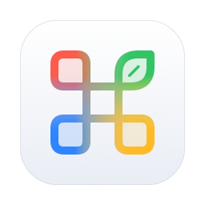
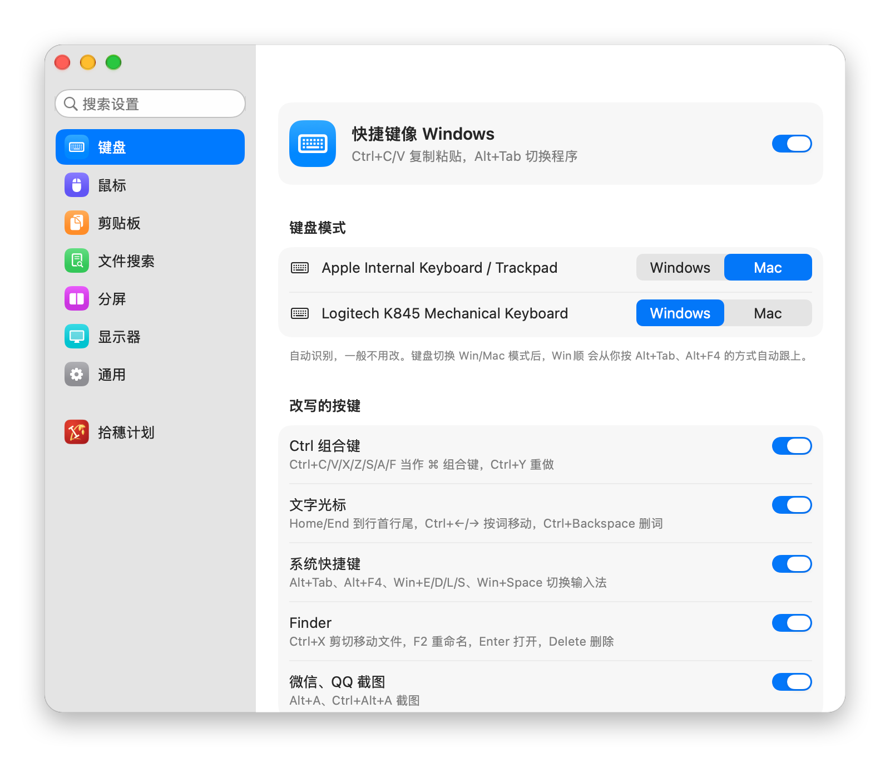
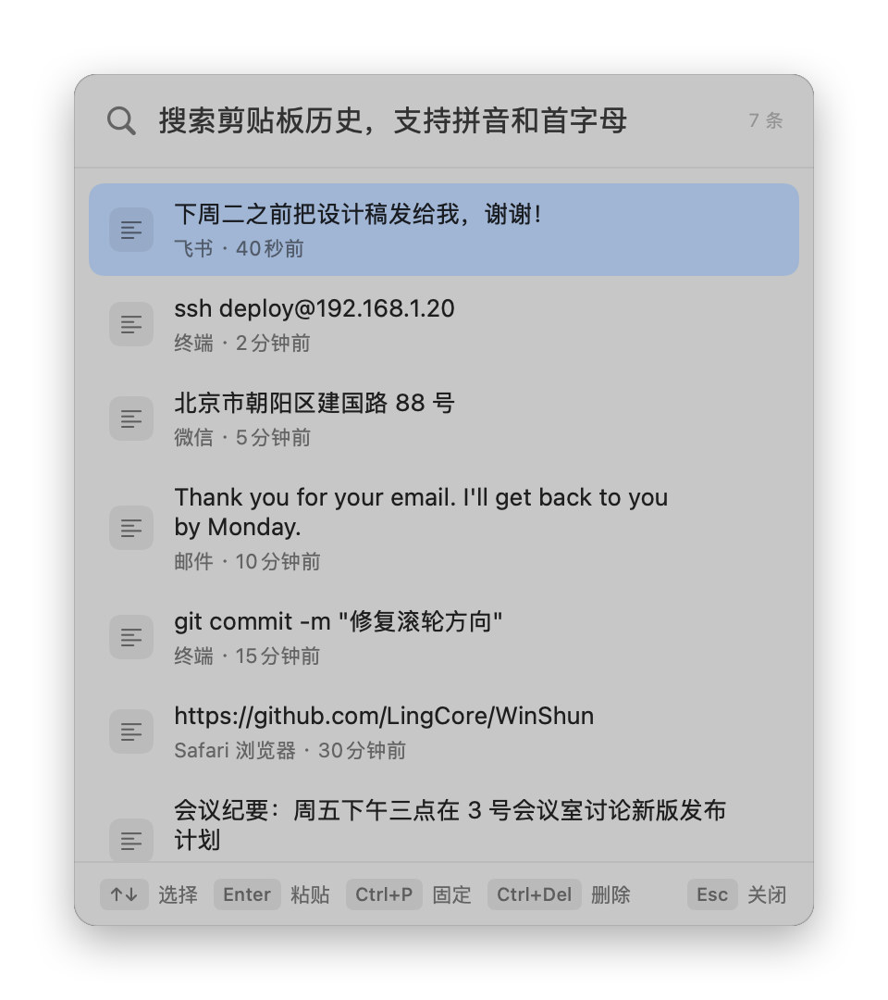
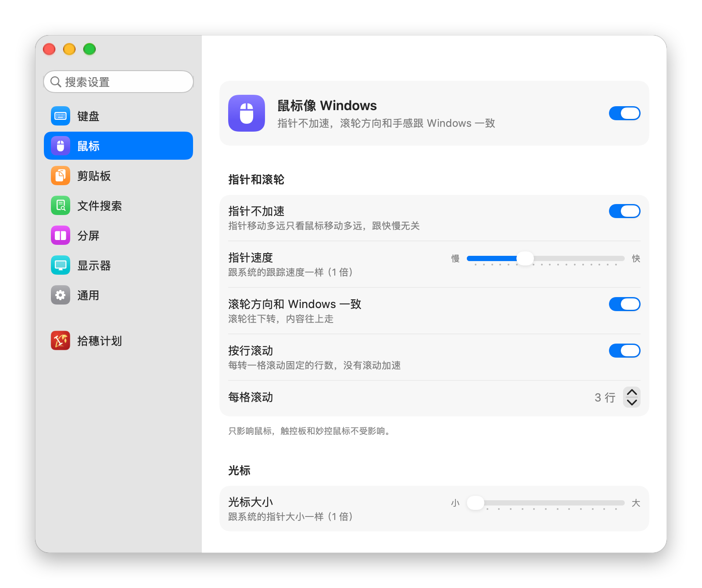
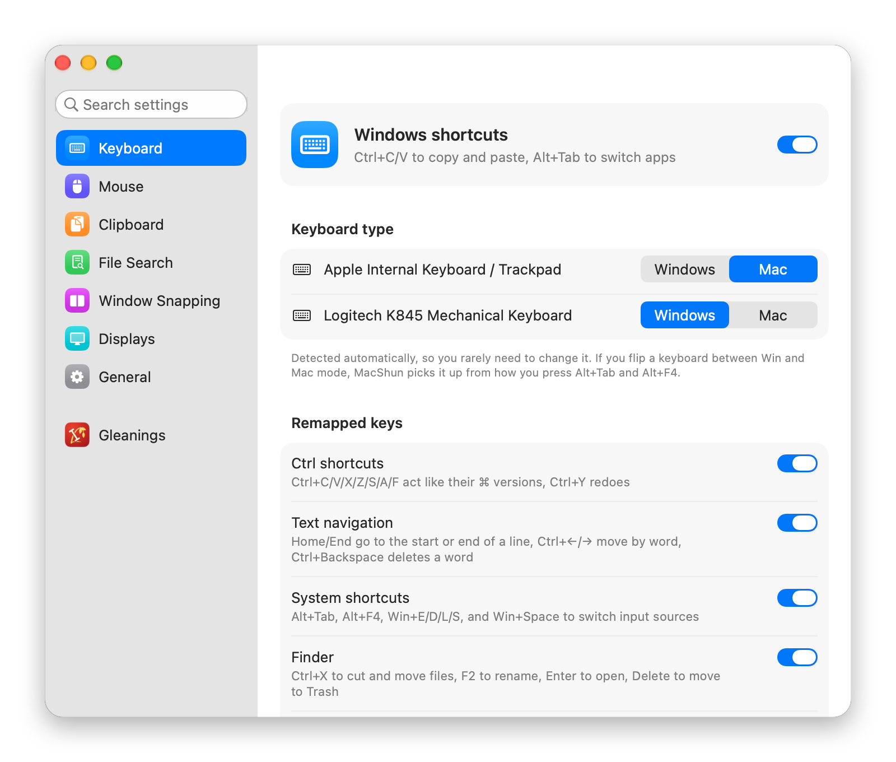
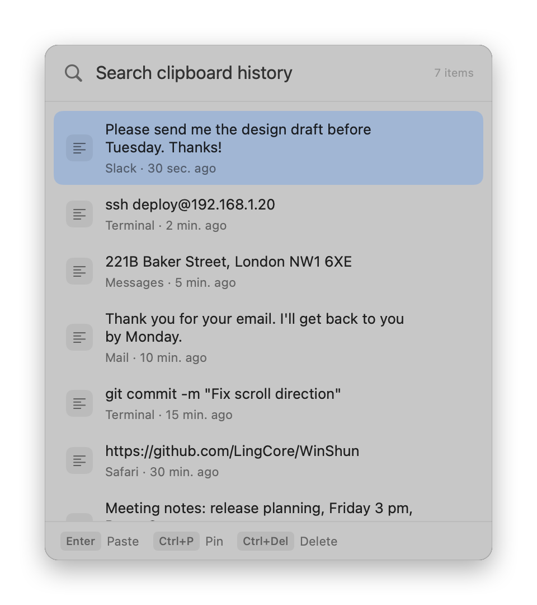
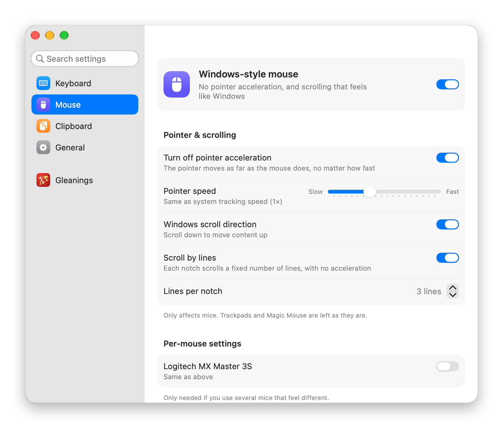

<p align="center">
  
</p>

<h1 align="center">Win顺 · WinShun</h1>

<p align="center">
  <b>让 Mac 像 Windows 一样顺手</b> —— 免费开源的 macOS 菜单栏小工具<br>
  <b>Use your Mac the Windows way</b> — a free, open-source macOS menu bar app
</p>

<p align="center">
  <a href="https://github.com/LingCore/WinShun/releases/latest"></a>
  
  
  <a href="LICENSE"></a>
  <a href="https://linux.do"></a>
</p>

<p align="center">
  <a href="#中文">中文</a> · <a href="#english">English</a>
</p>

<p align="center">
  <picture>
    <source media="(prefers-color-scheme: dark)" srcset="docs/images/keyboard-dark.png">
    
  </picture>
</p>

---

<a id="中文"></a>

## 中文

**Win顺 是什么？** 一个给“从 Windows 换到 Mac 的人”用的小工具。装上之后，Mac 上的快捷键、鼠标、剪贴板和分屏都按 Windows 的习惯工作：Ctrl+C / Ctrl+V 复制粘贴、Alt+Tab 切换窗口、鼠标滚轮方向和 Windows 一样、Win+V 打开剪贴板历史、Win+方向键分屏。不用学新的快捷键，也不用写任何配置。

它常驻在屏幕顶部的菜单栏，不占程序坞，不联网，不需要账号，完全免费。界面有简体中文和英文两种，默认跟随系统语言。

### 功能

#### ⌨️ 快捷键像 Windows

- **Ctrl 组合键**：Ctrl+C / V / X / Z / S / A / F 等代替 ⌘，Ctrl+Y 重做。
- **文字光标**：Home / End 到行首行尾，Ctrl+Home / End 到文档首尾，Ctrl+← / → 按词移动，Ctrl+Backspace 删一个词，按住 Shift 同时选中。
- **系统快捷键**：Alt+Tab 切换程序，Alt+F4 关闭窗口，Win+E 打开访达，Win+D 显示桌面，Win+L 锁屏，Win+S 搜索，Win+Space 切换输入法。
- **访达（Finder）**：Ctrl+X 再 Ctrl+V 剪切移动文件，F2 重命名，Enter 打开，Delete 移到废纸篓，Backspace 返回上一级。
- **聊天软件截图**：微信、QQ 里的 Alt+A、Ctrl+Alt+A 截图照常能用。
- **不该改的地方不改**：终端里保留原来的 Ctrl 键，远程桌面和虚拟机里不改写任何按键（包括 ToDesk、向日葵、UU 远程）。
- **两种键盘都能用**：Windows 键盘和 Mac 键盘上 Ctrl、Option、⌘ 的位置不同，Win顺 自动识别，不用设置。

#### 🖱️ 鼠标像 Windows

- **关闭鼠标加速**：指针移动多远只看鼠标移动多远，和 Windows 一样跟手。速度可以调得比系统设置的最快档还快。
- **滚轮方向和 Windows 一致**：只改鼠标，触控板和妙控鼠标保持苹果的“自然滚动”。
- **按行滚动**：每格滚动固定行数（默认 3 行），没有滚动加速。
- **侧键前进、后退**：鼠标第 4、5 键在访达、浏览器等所有程序里都能用。
- **光标大小**：像 Windows 一样在鼠标设置里直接调，1 到 4 倍。退出 Win顺 后恢复原样。
- 接了多个鼠标时，可以给每个鼠标单独设置。

所有选项都能用设置窗口顶部的**搜索框**找到（⌘F，支持拼音）。

#### 📋 剪贴板历史（Win+V）

- 按 **Win+V** 弹出最近复制过的内容，选中后直接粘贴。
- **支持拼音搜索**：输入全拼或首字母都能找到，比如输入 `jtb` 就能搜到“剪贴板”。
- 记录文字和图片，常用的内容可以固定在最上面。
- 自动跳过密码管理器标记为隐藏的内容。内容只存在你自己的电脑上。

<p align="center">
  <picture>
    <source media="(prefers-color-scheme: dark)" srcset="docs/images/panel-dark.png">
    
  </picture>
  &nbsp;
  <picture>
    <source media="(prefers-color-scheme: dark)" srcset="docs/images/mouse-dark.png">
    
  </picture>
</p>

#### 🔍 文件搜索（像 Everything）

- **连按两下 Ctrl**，屏幕上方弹出胶囊搜索框，边打字边出结果，几万个文件也是瞬间出来。
- **支持拼音和首字母**：输入 `bg` 找到“年度报告.docx”，输入 `bwl` 找到“备忘录”，输入 `weixin` 找到“微信”。
- **也能搜文件内容**：txt、Markdown、CSV、JSON、Word、Excel、PowerPoint、PDF 里的文字都能搜到，结果里直接显示匹配的那一行。中文按单字建索引，两个字的词也能搜到，不需要聚焦（Spotlight）。
- Enter 打开，Ctrl+Enter 在访达中显示；空格分开几个词可以同时匹配。
- 搜索个人文件夹、应用程序和外接硬盘（外接硬盘在后台扫描，跳过 Windows 系统文件夹）。文件名索引只放在内存里，内容索引只存在这台电脑上，都不联网。

#### 🪟 分屏（像 Windows 11）

- **Win+← / →** 分到左右半边，半边时 **Win+↑ / ↓** 变成四分之一；按反方向恢复原来的大小，同一方向再按移到隔壁屏幕。
- **Win+↑** 最大化，**Win+↓** 恢复或最小化；**Win+Shift+← / →** 把窗口移到另一块屏幕。
- **拖到屏幕边缘分屏**：拖到左右边分到半边，拖到上边最大化，拖到四个角分到四分之一；拖动分好的窗口会恢复原来的大小。有两块屏幕时，拖到中间相接的边，光标会先停一下，松开就分到这块屏幕靠那边的一半，继续推才过到另一块屏幕。
- **贴靠助手**：分好一半后，另一半列出其他窗口，点一个就放进去。这是 Windows 的招牌功能，Rectangle 和 macOS 自带的分屏都没有。

#### 🖥️ 显示器缩放和刷新率

- 每块屏幕单独选缩放，像 Windows 一样按百分比（100%、125%、150%…）选，不用去系统设置里猜“看起来像多少”。
- 只列出文字清晰的档位。2K 这类非高分屏，macOS 只给 100% 和 200% 两个清晰档位，页面上会说明。
- 每块屏幕单独选刷新率（144 Hz、120 Hz、60 Hz…），高刷屏不用再去系统设置里找。

### 下载安装

1. 到 [Releases 页面](https://github.com/LingCore/WinShun/releases/latest) 下载 `WinShun-版本号.dmg`。**同一个文件同时支持 Apple 芯片（M1/M2/M3/M4…）和 Intel 芯片的 Mac**，不用挑版本。
2. 双击打开 dmg，把 **Win顺** 拖进“应用程序”文件夹。
3. 第一次打开时，macOS 会提示“无法验证开发者”。这是因为作者还没有购买苹果的开发者证书，不是程序有问题。按下面的办法打开一次，以后就不会再问：
   - 打开“系统设置 → 隐私与安全性”，拉到最下面，点 **“仍要打开”**，输入密码确认。
   - 或者在“终端”里运行：`xattr -dr com.apple.quarantine "/Applications/Win顺.app"`
4. 按提示授权（见下一节），菜单栏出现 Win顺 的图标就说明在运行了。

系统要求：macOS 14 Sonoma 或更新版本。

### 需要的权限

改写按键和鼠标需要系统授权。Win顺 的设置窗口会一步一步带你打开对应的设置页，授权后马上生效：

| 权限 | 用来做什么 |
|---|---|
| 辅助功能 | 改写按键、粘贴剪贴板内容、找到文字光标的位置、移动和调整别的程序的窗口（分屏） |
| 输入监控 | 识别是哪个键盘、哪个鼠标在输入（可以给每个设备单独设置） |
| 剪贴板读取 | 在后台记录剪贴板历史（在系统设置里选“始终允许”） |
| 文件和文件夹 | 第一次打开文件搜索时，系统会问能不能访问“桌面”“文稿”“下载”；点了不允许的文件夹搜不到 |

### 常见问题

**Mac 上怎么用 Ctrl+C、Ctrl+V 复制粘贴？**
装上 Win顺 就行。它把 Ctrl+字母自动换成 ⌘+字母，所有程序里都有效；终端里保持原样，不影响命令行。

**Mac 鼠标滚轮方向是反的，怎么只改鼠标、不改触控板？**
macOS 自带的设置里，鼠标和触控板的滚动方向是绑在一起的。Win顺 只改鼠标的方向，触控板不受影响。

**Mac 怎么关闭鼠标加速？**
在 Win顺 的“鼠标”页打开“指针不加速”。指针速度还能调得比系统允许的最快速度更快。

**Mac 有没有像 Windows Win+V 那样的剪贴板历史？**
有。Win顺 自带剪贴板历史，按 Win+V 弹出，支持拼音搜索。

**和 Karabiner-Elements、LinearMouse、Maccy、Rectangle 有什么区别？**
这些都是很好的工具，但要分别安装、自己配置。Win顺 把“快捷键 + 鼠标 + 剪贴板 + 分屏”一次做好，默认就是 Windows 的习惯，装上即用，并且针对中文用户做了优化（拼音搜索、微信 QQ 截图、国产远程软件）。

**Mac 怎么像 Windows 一样用 Win+方向键分屏？**
装上 Win顺 就行：Win+← / → 分到左右半边，Win+↑ 最大化，拖到屏幕边缘也能分屏，分好一半后还会列出其他窗口让你选另一半（贴靠助手）。

**Mac 上有没有像 Everything 那样快速搜索文件的工具？**
装上 Win顺，连按两下 Ctrl 就能搜，支持拼音首字母，不用记完整文件名。

**Mac 怎么搜 Word、Excel、PDF 里的文字？**
Win顺 的文件搜索也能按内容搜：txt、CSV、JSON、Word、Excel、PowerPoint、PDF 都支持，外接的 NTFS 硬盘也能搜，结果里直接显示匹配的那一行。

**Mac 接了两块屏幕，怎么让它们的缩放不一样？**
macOS 本来就支持每块屏幕单独设置。Win顺 的“显示器”页把它做成了 Windows 那样的百分比，每块屏一个下拉菜单。

**收费吗？会上传我的数据吗？**
完全免费，源代码公开。Win顺 不联网，剪贴板内容只保存在你自己的电脑上。

**怎么卸载？**
在菜单栏图标里选“退出”，然后把“应用程序”文件夹里的 Win顺 拖到废纸篓。

### 反馈

遇到问题或有建议，欢迎在 [Issues](https://github.com/LingCore/WinShun/issues) 里提出。

### 从源码编译

只需要 Command Line Tools（`xcode-select --install`），不需要 Xcode。

```bash
scripts/dev-cert.sh            # 第一次：生成开发用的签名证书（只需一次）
scripts/build-app.sh --install # 编译打包，装到“应用程序”文件夹并启动
scripts/test.sh                # 运行单元测试
scripts/check-l10n.py          # 检查界面文字是否都有英文翻译
scripts/release.sh             # 打包发布用的通用版 dmg（Apple 芯片 + Intel）
```

源码结构和设计见 [docs/architecture.md](docs/architecture.md)，需求明细见 [docs/requirements.md](docs/requirements.md)。

---

<a id="english"></a>

## English

**What is WinShun?** WinShun (Win顺, "Windows made smooth") is a small macOS menu bar app for people switching from Windows to Mac. It makes your Mac's keyboard shortcuts, mouse, clipboard and window snapping behave the way Windows does: Ctrl+C / Ctrl+V to copy and paste, Alt+Tab to switch apps, Windows-style mouse wheel direction, Win+V clipboard history and Win+arrow window snapping. No new shortcuts to learn and no configuration files to write.

It lives in the menu bar, stays out of the Dock, works offline, needs no account, and is completely free.

The interface is available in **English** and **Simplified Chinese**. It follows your system language, or you can pick one in Settings › General.

<p align="center">
  <picture>
    <source media="(prefers-color-scheme: dark)" srcset="docs/images/keyboard-dark-en.png">
    
  </picture>
</p>

### Features

#### ⌨️ Windows keyboard shortcuts on Mac

- **Ctrl shortcuts**: Ctrl+C / V / X / Z / S / A / F and friends work like ⌘; Ctrl+Y is redo.
- **Text navigation**: Home / End jump to the start / end of the line, Ctrl+Home / End to the start / end of the document, Ctrl+← / → move by word, Ctrl+Backspace deletes a word; hold Shift to select.
- **System shortcuts**: Alt+Tab switches apps, Alt+F4 closes the window, Win+E opens Finder, Win+D shows the desktop, Win+L locks the screen, Win+S searches, Win+Space switches input method.
- **Finder**: Ctrl+X then Ctrl+V cuts and moves files, F2 renames, Enter opens, Delete moves to Trash, Backspace goes up a folder.
- **Leaves things alone where it should**: Terminal keeps its Ctrl keys; remote desktop and virtual machine apps are never remapped.
- **Works with both keyboard types**: Windows and Mac keyboards put Ctrl, Option and ⌘ in different places — WinShun detects which one you are typing on.

#### 🖱️ Windows mouse behavior on Mac

- **Disable mouse acceleration**: pointer movement is linear, just like Windows. Speed can go beyond the fastest system setting.
- **Windows scroll direction for the mouse only**: the trackpad and Magic Mouse keep Apple's natural scrolling.
- **Line-by-line scrolling**: a fixed number of lines per notch (3 by default), no scroll acceleration.
- **Back / forward side buttons** work in Finder, browsers and every other app.
- **Cursor size** right in the mouse settings, 1× to 4×, like Windows. Restored when you quit WinShun.
- Per-device settings when you use more than one mouse.

Every option can be found with the **search box** at the top of the settings window (⌘F).

#### 📋 Clipboard history (Win+V)

- Press **Win+V** to see what you copied recently and paste it with one key.
- **Pinyin search** for Chinese text (full pinyin or initials, e.g. `jtb` finds 剪贴板).
- Stores text and images; pin the items you use often.
- Skips content that password managers mark as concealed. Everything stays on your Mac.

<p align="center">
  <picture>
    <source media="(prefers-color-scheme: dark)" srcset="docs/images/panel-dark-en.png">
    
  </picture>
  &nbsp;
  <picture>
    <source media="(prefers-color-scheme: dark)" srcset="docs/images/mouse-dark-en.png">
    
  </picture>
</p>

#### 🔍 File search (like Everything)

- **Press Ctrl twice** to open a capsule search bar; results appear as you type, instantly even across tens of thousands of files.
- **Pinyin search** for Chinese file and app names.
- **Searches file contents too**: text inside txt, Markdown, CSV, JSON, Word, Excel, PowerPoint and PDF files, with the matching line shown in the results. Works for short Chinese queries and doesn't depend on Spotlight.
- Enter opens, Ctrl+Enter shows in Finder; separate words with spaces to match them all.
- Searches your home folder, Applications and external drives (scanned in the background, Windows system folders skipped). The file name index stays in memory and the content index stays on your Mac; nothing goes online.

#### 🪟 Window snapping (like Windows 11)

- **Win+← / →** snaps to the left or right half; from a half, **Win+↑ / ↓** snaps to a quarter. The opposite arrow restores the window, the same arrow again moves it to the next display.
- **Win+↑** maximizes, **Win+↓** restores or minimizes; **Win+Shift+← / →** moves the window to the other display.
- **Drag to screen edges**: left or right edge for halves, top edge to maximize, corners for quarters. Dragging a snapped window restores its size. With two displays, the cursor pauses at the edge where they meet, so you can snap to the inner half; keep pushing to cross over.
- **Snap Assist**: after snapping to a half, your other windows appear in the other half; click one to fill it. Neither Rectangle nor macOS tiling has this.

#### 🖥️ Display scaling and refresh rate

- Pick scaling for each screen in Windows-style percentages (100%, 125%, 150%…) instead of guessing "looks like" resolutions.
- Only sharp options are listed. For non-Retina screens such as 1440p monitors, macOS only offers 100% and 200% sharply, and the page says so.
- Pick the refresh rate for each screen (144 Hz, 120 Hz, 60 Hz…) right next to scaling.

### Download and install

1. Download `WinShun-<version>.dmg` from the [Releases page](https://github.com/LingCore/WinShun/releases/latest). **One universal file runs natively on both Apple Silicon (M1/M2/M3/M4…) and Intel Macs.**
2. Open the dmg and drag **Win顺** into Applications.
3. On first launch macOS says it cannot verify the developer, because the app is not yet signed with a paid Apple Developer ID. Open it once using either method; macOS won't ask again:
   - Go to **System Settings → Privacy & Security**, scroll down and click **Open Anyway**.
   - Or run in Terminal: `xattr -dr com.apple.quarantine "/Applications/Win顺.app"`
4. Grant the permissions below. When the WinShun icon appears in the menu bar, it is running.

Requires macOS 14 Sonoma or later.

### Permissions

| Permission | Why |
|---|---|
| Accessibility | Remap keys, paste from history, find the text cursor, move and resize other apps' windows (snapping) |
| Input Monitoring | Tell which keyboard or mouse an event came from (per-device settings) |
| Pasteboard access | Record clipboard history in the background (choose "Always Allow") |
| Files and Folders | The first time you open file search, macOS asks about Desktop, Documents and Downloads; folders you deny won't be searched |

The settings window walks you through each one, and changes take effect immediately.

### FAQ

**How do I use Ctrl+C and Ctrl+V on a Mac?**
Install WinShun. It turns Ctrl+letter into ⌘+letter in every app, except Terminal, where Ctrl keeps its usual meaning.

**How do I reverse the mouse scroll direction without changing the trackpad?**
macOS ties the two together. WinShun changes the direction for mice only.

**How do I turn off mouse acceleration on macOS?**
Enable "linear pointer" on WinShun's Mouse page.

**Is there a Win+V clipboard history for Mac?**
Yes — WinShun includes one, with search.

**How do I snap windows with Win+arrow keys on a Mac, like on Windows?**
Install WinShun: Win+← / → snaps to halves, Win+↑ maximizes, dragging to screen edges snaps too, and Snap Assist offers your other windows for the other half.

**How is it different from Karabiner-Elements, LinearMouse, Maccy or Rectangle?**
Those are great tools, but each does one thing and needs setup. WinShun does keyboard, mouse, clipboard and window snapping together, with Windows behavior as the default, and is tuned for Chinese users (pinyin search, WeChat / QQ screenshot keys, popular Chinese remote desktop apps).

**Is there an Everything-like file search for Mac?**
WinShun includes one: press Ctrl twice and start typing.

**How do I search text inside Word, Excel or PDF files on a Mac?**
WinShun's file search also matches contents of txt, CSV, JSON, Word, Excel, PowerPoint and PDF files, including on external NTFS drives, and shows the matching line.

**How do I use different scaling on two monitors?**
macOS supports per-display scaling; WinShun's Displays page shows it as Windows-style percentages, one menu per screen.

**Is it free? Does it collect data?**
Free and open source. WinShun never connects to the internet; your clipboard history stays on your Mac.

### Feedback

Bug reports and suggestions are welcome in [Issues](https://github.com/LingCore/WinShun/issues).

### Build from source

Only the Command Line Tools are needed (`xcode-select --install`), not Xcode.

```bash
scripts/dev-cert.sh            # once: create a local code-signing certificate
scripts/build-app.sh --install # build, install to /Applications and launch
scripts/test.sh                # run unit tests
scripts/check-l10n.py          # check that every UI string has an English translation
scripts/release.sh             # build the universal release dmg (Apple Silicon + Intel)
```

---

## LINUX DO

本项目积极参与并认可 [LINUX DO 社区](https://linux.do)。

WinShun is proud to be part of the [LINUX DO community](https://linux.do).

## 许可证 · License

Win顺 以 [GPL-3.0-or-later](LICENSE) 发布。Copyright © 2026 LingCore.
借用的第三方代码登记在 [THIRD_PARTY_NOTICES.md](THIRD_PARTY_NOTICES.md)。

WinShun is released under [GPL-3.0-or-later](LICENSE). Copyright © 2026 LingCore.

Windows 是微软公司的商标，Mac 和 macOS 是苹果公司的商标。本项目与微软、苹果没有任何关联。
Windows is a trademark of Microsoft Corporation. Mac and macOS are trademarks of Apple Inc. This project is not affiliated with Microsoft or Apple.
