<p align="center">
  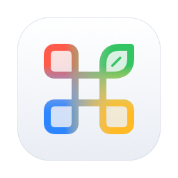
</p>

<h1 align="center">Mac顺 · MacShun</h1>

<p align="center">
  <b>让 Mac 用得更顺手</b> —— 免费开源的 macOS 菜单栏小工具<br>
  <b>Make your Mac smoother to use</b> — a free, open-source macOS menu bar app<br>
  <sub>原名 Win顺 · formerly WinShun</sub>
</p>

<p align="center">
  <a href="https://github.com/LingCore/MacShun/releases/latest"></a>
  
  
  <a href="LICENSE"></a>
  <a href="https://linux.do"></a>
</p>

<p align="center">
  <a href="#中文">中文</a> · <a href="#english">English</a>
</p>

<p align="center">
  <picture>
    <source media="(prefers-color-scheme: dark)" srcset="docs/images/keyboard-dark.png">
    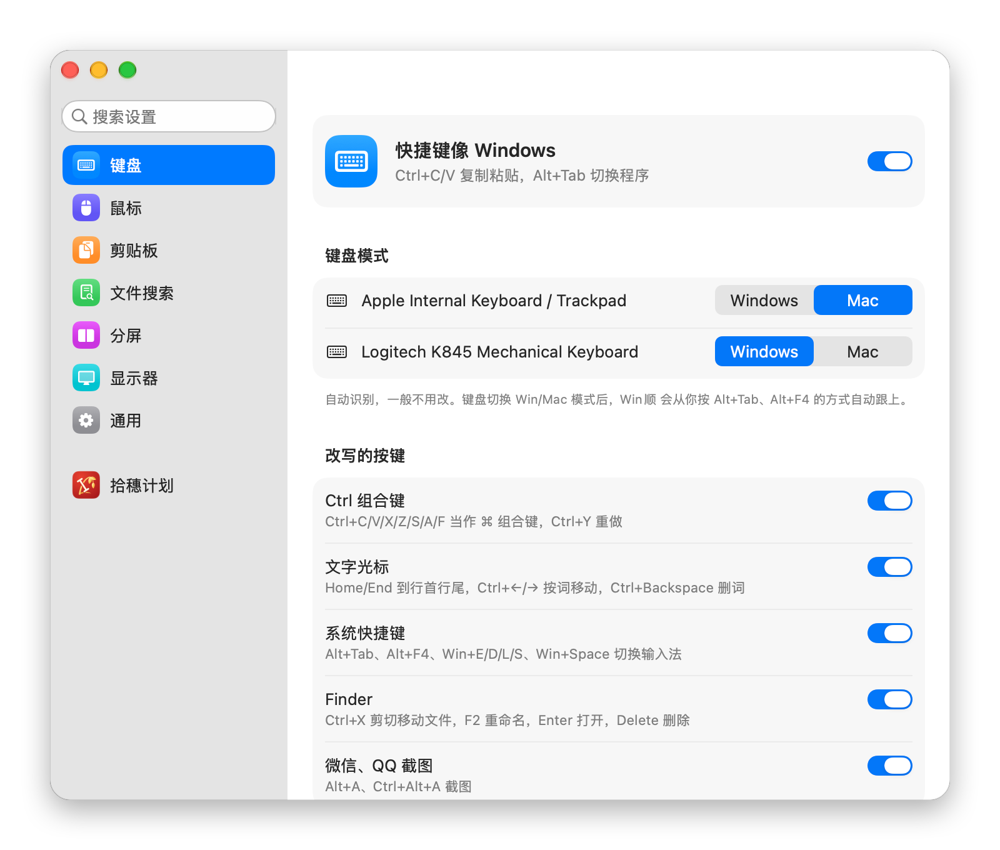
  </picture>
</p>

---

<a id="中文"></a>

## 中文

**Mac顺 是什么？** 一个让 Mac 用得更顺手的小工具。Mac 自带的没有、或者藏得很深的常用功能，装上就有：剪贴板历史、连按两下 Ctrl 搜文件（文件里的字也能搜）、窗口分屏、关掉鼠标加速、每块屏幕按百分比调缩放。从 Windows 换过来的人，还能直接用熟悉的习惯：Ctrl+C / Ctrl+V 复制粘贴、Alt+Tab 切换窗口、鼠标滚轮方向和 Windows 一样。不用学新的快捷键，也不用写任何配置。

它常驻在屏幕顶部的菜单栏，不占程序坞，除了检查更新和每天一次的匿名装机报告（可在“设置 › 通用”关闭）不联网，不需要账号，完全免费。界面有简体中文和英文两种，默认跟随系统语言。

### 功能

#### 📋 剪贴板历史（Option+V / Win+V）

- Mac 键盘按 **⌥ Option+V**，Windows 键盘按 **Win+V**，也可以点菜单栏的 Mac顺 图标，选择 **打开剪贴板历史**。选中一条按回车即可粘贴。在文件搜索框里打开时，选中的文字会填进搜索框。
- **支持拼音搜索**：输入全拼或首字母都能找到，比如输入 `jtb` 就能搜到“剪贴板”。
- 记录文字和图片，常用的内容可以固定在最上面。右上角“全部清除”一键清空历史，固定的保留。
- 历史图片上右键选 **复制图中文字**，即可复制完整识别结果；按 Enter 仍粘贴图片。
- **按图中文字找图片**：已记录的截图和图片会在本机后台识别，旧历史也会补上。按 Win+V 输入图里的文字或拼音，按 Enter 粘贴原图，按 F3 将它贴到屏幕。
- 自动跳过密码管理器标记为隐藏的内容。内容只存在你自己的电脑上。

<p align="center">
  <picture>
    <source media="(prefers-color-scheme: dark)" srcset="docs/images/panel-dark.png">
    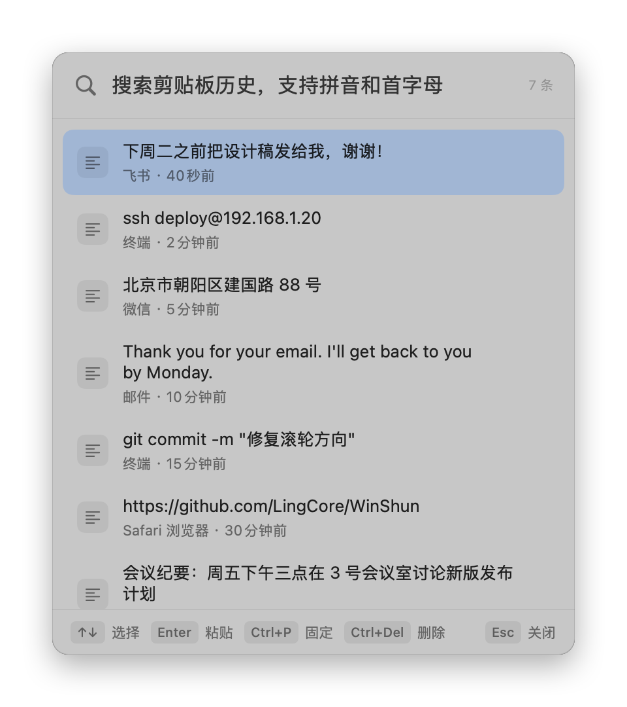
  </picture>
</p>

#### 截图与识别屏幕文字

- 从菜单栏点 **开始截图**，拖选区域或点选窗口。拖动选区或边框可调整范围，也可画箭头、矩形或实心遮挡。按 **Enter** 复制、**⌘S** 保存 PNG、**Esc** 取消。
- 只想复制文字时，选 **识别屏幕文字**，框选后松开鼠标即可。简体、繁体中文和英文在本机识别。
- **写说明和标步骤**：选「文字标注」后点一下输入，Enter 完成文字，双击可再改。选「步骤序号」后连续点击即可放置 1、2、3。用选择工具点中标注可拖动，按 Delete 删除，⌘Z 撤销，⇧⌘Z 重做。
- **对齐同一区域**：再次截图时按 R 恢复上一次成功输出的选框。方向键移动 1 个实际像素，Shift 加方向键调整宽高。选框旁显示导出尺寸。
- **长截图**：框住网页、文档或聊天记录里需要滚动的内容，点「长截图」或按 **⌘L / Ctrl+L**。等蓝框旁提示可以滚动后，用鼠标或触控板慢慢向下滚，点「完成」预览。要在长图上写说明或遮住一行，点「标注」，滚动到对应位置编辑，点「完成标注」后再复制、保存 PNG 或贴到屏幕。允许辅助功能后也可用 Enter 完成、Esc 取消。选区尽量只框正文，避开固定侧栏；如果画面中有大面积视频，先暂停播放。如果提示找不到重叠内容，往回滚一些再继续。
- **贴图**：选好截图后按 **F3** 或点「贴到屏幕」，含标注的图片会留在原处。也可从菜单栏「贴出剪贴板图片」，或在历史图片上右键贴出。拖动移动、拖角或滚轮缩放、双击恢复原始大小，Ctrl 加滚轮调透明度。右键可复制、保存和关闭；点中贴图后按 Esc 也能关闭。
- 两个操作都可以在 **设置 › 键盘 › 截图快捷键** 录入快捷键，默认留空。首次使用按系统提示允许屏幕录制。

#### 🔍 文件搜索（像 Everything）

- **连按两下 Ctrl**，屏幕上方弹出胶囊搜索框，边打字边出结果，几万个文件也是瞬间出来。搜索框开着时再连按也不会关掉，Esc 关闭。
- **支持拼音和首字母**：输入 `bg` 找到“年度报告.docx”，输入 `bwl` 找到“备忘录”，输入 `weixin` 找到“微信”。
- **按日常说法找系统功能**：输入“耳机连不上”打开蓝牙设置，“谁在占内存”打开活动监视器；输入 Windows 叫法“任务管理器”也能找到它。用方向键选择、Enter 打开。切到 **系统** 可以浏览所有收录的入口，全程在本机匹配。
- **也能搜文件内容**：txt、Markdown、CSV、JSON，代码（ts、js、py、swift、vue、html 等）、配置（yaml、xml、toml）、字幕（srt、ass、lrc），以及 Word、Excel、PowerPoint、PDF 里的文字都能搜到（跳过 node_modules、dist、build 这类生成和依赖的文件夹）；截图、照片和扫描版 PDF 里的字也会自动识别，结果里直接显示匹配的那一行。中文按单字建索引，两个字的词也能搜到，不需要聚焦（Spotlight）。默认选 **文件与功能**，按 Tab 或点击右侧可切到 **全部 / 内容 / 系统**；只有“全部”和“内容”会搜文件正文。常打开的文件会排在前面。
- **筛选文件**。输入 `报价 *.pdf !草稿` 搜 PDF，并排除文件名含“草稿”的结果。`ext:pdf,docx` 可同时选两种格式。切换到“内容”时，关键词搜正文，筛选条件仍作用于文件名。要搜索字面名称 `!重要`，输入 `"!重要"`。
- Enter 打开，Ctrl+Enter 在访达中显示。按 **⌘Y** 或点“快速查看”预览选中项，按 ↑↓ 依次查看，Esc 返回原来的搜索结果。
- **在项目里查找**。选中普通文件夹后按 **⌘F**，或右键选“在此文件夹中搜索”。输入关键词或筛选条件会搜索子文件夹，切到“内容”可查这个范围内已收录的正文。按 **Esc** 回到原来的搜索词和选中项。
- **在“打开”和“存储”窗口里找位置**。原生文件对话框打开时连按两下 **Ctrl**，搜索文件或目录，按 **Enter** 让对话框前往该目录或文件所在的目录。存储时会保留已输入的文件名。
- **可以直接粘贴路径**：`art/gpt/style_reference.png` 这样的相对路径、`桌面/塔防游戏/…` 这样用访达里显示的名字写的、`~/Desktop/…` 和完整路径都行，Windows 的 `D:\资料\合同.docx`（带不带引号都行）也认，盘符不管。文件夹写得不全或不对也没关系，名字对上的文件照样列出来，路径对上得越多排得越前。输入本机目录的完整路径并在末尾加 `/` 会列出直接子项，继续打字可在这一层筛选，包括可读取但未收录的目录。普通搜索也可以混合文件夹和文件名，例如 `春季 报价单` 能找到 `春季项目/报价单.xlsx`。完整名称优先，同名时优先当前访达文件夹。
- 搜索个人文件夹、应用程序和外接硬盘（外接硬盘在后台扫描，跳过 Windows 系统文件夹）。点号开头的文件和文件夹也能按名称找到，例如 `.gitignore` 和 `.config`。这些文件及点号目录里的文件只收录名称。文件名索引只放在内存里，内容索引只存在这台电脑上，都不联网。

<p align="center">
  <picture>
    <source media="(prefers-color-scheme: dark)" srcset="docs/images/search-dark.png">
    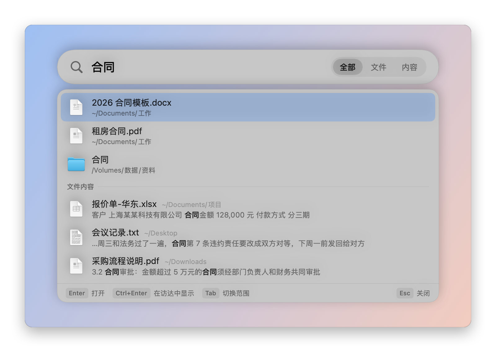
  </picture>
</p>

#### 🪟 分屏（像 Windows 11）

- **Win+← / →** 分到左右半边，半边时 **Win+↑ / ↓** 变成四分之一；按反方向恢复原来的大小，同一方向再按移到隔壁屏幕。
- **Win+↑** 最大化，**Win+↓** 恢复或最小化；**Win+Shift+← / →** 把窗口移到另一块屏幕。
- **拖到屏幕边缘分屏**：拖到左右边分到半边，拖到上边最大化，拖到四个角分到四分之一；拖动分好的窗口会恢复原来的大小。多显示器之间可以直接拖过；想在中间相接的边分屏时，在目标屏幕的边缘附近停一下，出现预览后松开即可。
- **贴靠助手**：分好一半后，另一半列出其他窗口，点一个就放进去。这是 Windows 的招牌功能，Rectangle 和 macOS 自带的分屏都没有。

<p align="center">
  <picture>
    <source media="(prefers-color-scheme: dark)" srcset="docs/images/snap-dark.png">
    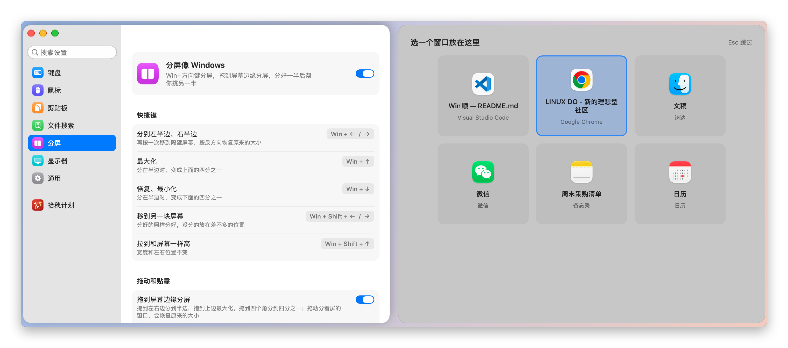
  </picture>
</p>

#### 🖱️ 鼠标像 Windows

- **关闭鼠标加速**：指针移动多远只看鼠标移动多远，和 Windows 一样跟手。速度可以调得比系统设置的最快档还快。
- **滚轮方向和 Windows 一致**：只改鼠标，触控板和妙控鼠标保持苹果的“自然滚动”。
- **按行滚动**：每格滚动固定行数（默认 3 行），没有滚动加速。
- **侧键前进、后退**：鼠标第 4、5 键在访达、浏览器等所有程序里都能用。两个侧键也可以分别改成复制、粘贴、关闭标签页、任务视图、剪贴板历史，或者录一组任意的快捷键（按 Windows 的叫法录，比如 Ctrl+Shift+T）。用罗技、雷蛇等鼠标软件设置侧键的，选“不处理”，侧键原样交给它们，不会冲突。
- **光标大小**：像 Windows 一样在鼠标设置里直接调，1 到 4 倍。退出 Mac顺 后恢复原样。
- 接了多个鼠标时，可以给每个鼠标单独设置。

<p align="center">
  <picture>
    <source media="(prefers-color-scheme: dark)" srcset="docs/images/mouse-dark.png">
    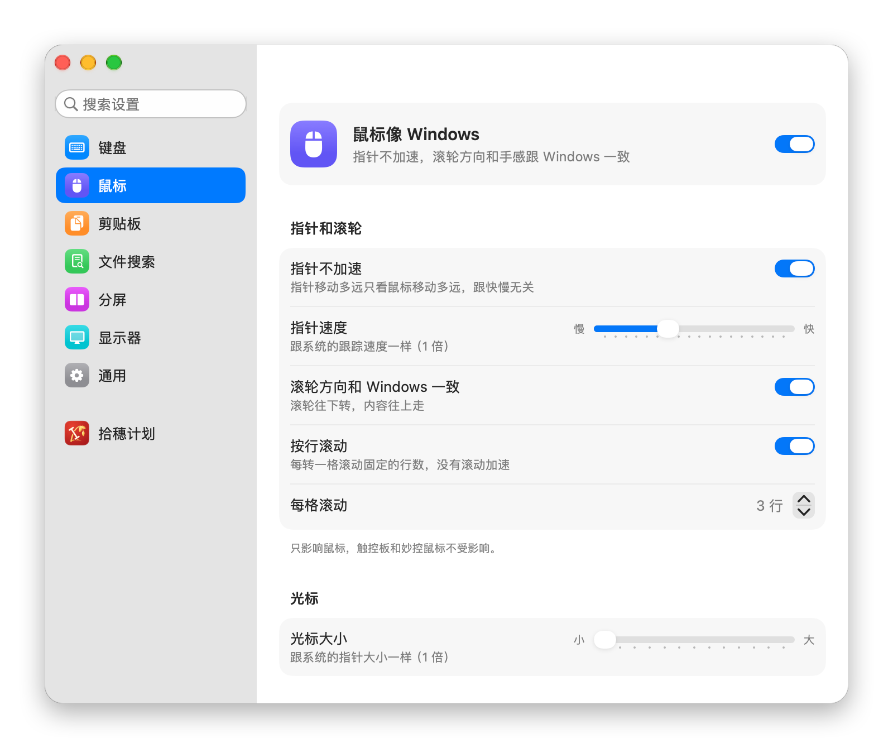
  </picture>
</p>

#### 🖥️ 显示器缩放和刷新率

- 每块屏幕单独选缩放，像 Windows 一样按百分比（100%、125%、150%…）选，不用去系统设置里猜“看起来像多少”。
- 只列出文字清晰的档位。2K 这类非高分屏，macOS 只给 100% 和 200% 两个清晰档位，页面上会说明。
- 每块屏幕单独选刷新率（144 Hz、120 Hz、60 Hz…），高刷屏不用再去系统设置里找。

<p align="center">
  <picture>
    <source media="(prefers-color-scheme: dark)" srcset="docs/images/display-dark.png">
    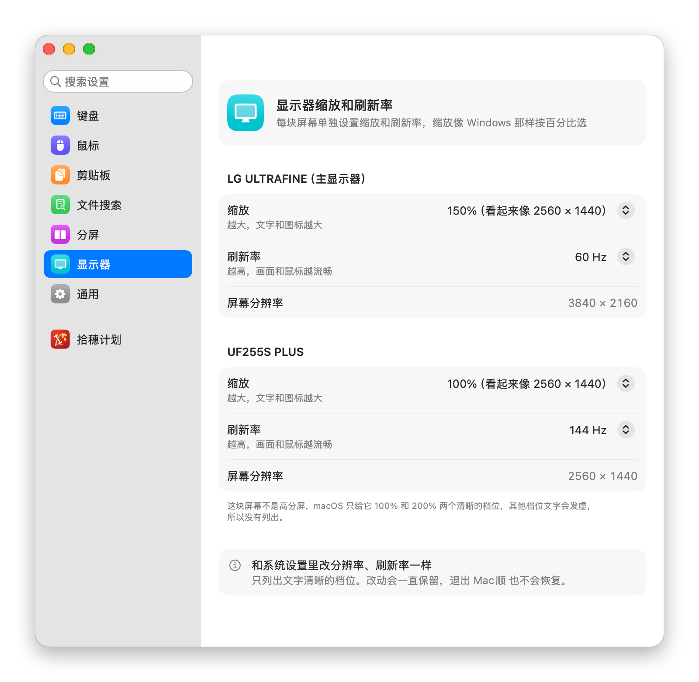
  </picture>
</p>

#### ⌨️ 快捷键像 Windows

- **Ctrl 组合键**：Ctrl+C / V / X / Z / S / A / F 等代替 ⌘，Ctrl+Y 重做。
- **文字光标**：Home / End 到行首行尾，Ctrl+Home / End 到文档首尾，Ctrl+← / → 按词移动，Ctrl+Backspace 删一个词，按住 Shift 同时选中。
- **系统快捷键**：Alt+Tab 切换程序，Alt+F4 关闭窗口，Win+E 打开访达，Win+D 显示桌面，Win+L 锁屏，Win+S 搜索，Win+Space 切换输入法。
- **访达（Finder）**：Ctrl+X 再 Ctrl+V 剪切移动文件，F2 重命名，Enter 打开，Delete 移到废纸篓，Backspace 返回上一级。
- **聊天软件截图**：微信、QQ 里的 Alt+A、Ctrl+Alt+A 截图照常能用。
- **不该改的地方不改**：终端里保留原来的 Ctrl 键，远程桌面和虚拟机里不改写任何按键（包括 ToDesk、向日葵、UU 远程）。
- **两种键盘都能用**：Windows 键盘和 Mac 键盘上 Ctrl、Option、⌘ 的位置不同，Mac顺 自动识别，不用设置。

所有选项都能用设置窗口顶部的**搜索框**找到（⌘F，支持拼音）。

### 下载安装

1. 到 [Releases 页面](https://github.com/LingCore/MacShun/releases/latest) 下载 `MacShun-版本号.dmg`。**同一个文件同时支持 Apple 芯片（M1/M2/M3/M4…）和 Intel 芯片的 Mac**，不用挑版本。
2. 双击打开 dmg，把 **Mac顺** 拖进“应用程序”文件夹。
3. 第一次打开时，macOS 会提示“无法验证开发者”。这是因为作者还没有购买苹果的开发者证书，不是程序有问题。按下面的办法打开一次，以后就不会再问：
   - 打开“系统设置 → 隐私与安全性”，拉到最下面，点 **“仍要打开”**，输入密码确认。
   - 或者在“终端”里运行：`xattr -dr com.apple.quarantine "/Applications/Mac顺.app"`
4. 按提示授权（见下一节），菜单栏出现 Mac顺 的图标就说明在运行了。

系统要求：macOS 14 Sonoma 或更新版本。

### 需要的权限

改写按键和鼠标需要系统授权。Mac顺 的设置窗口会一步一步带你打开对应的设置页，授权后马上生效：

| 权限 | 用来做什么 |
|---|---|
| 辅助功能 | 改写按键、粘贴剪贴板内容、找到文字光标的位置、移动和调整别的程序的窗口（分屏） |
| 输入监控 | 识别是哪个键盘、哪个鼠标在输入（可以给每个设备单独设置） |
| 剪贴板读取 | 在后台记录剪贴板历史（在系统设置里选“始终允许”） |
| 文件和文件夹 | 第一次打开文件搜索时，系统会问能不能访问“桌面”“文稿”“下载”；点了不允许的文件夹搜不到 |

### 常见问题

**Mac 上怎么用 Ctrl+C、Ctrl+V 复制粘贴？**
装上 Mac顺 就行。它把 Ctrl+字母自动换成 ⌘+字母，所有程序里都有效；终端里保持原样，不影响命令行。

**Mac 鼠标滚轮方向是反的，怎么只改鼠标、不改触控板？**
macOS 自带的设置里，鼠标和触控板的滚动方向是绑在一起的。Mac顺 只改鼠标的方向，触控板不受影响。

**Mac 怎么关闭鼠标加速？**
在 Mac顺 的“鼠标”页打开“指针不加速”。指针速度还能调得比系统允许的最快速度更快。

**Mac 有没有像 Windows Win+V 那样的剪贴板历史？**
有。Mac 键盘按 **Option+V** 打开历史，**Command+V** 直接粘贴。Windows 键盘按 **Win+V** 打开。关闭“快捷键像 Windows”后，仍可从菜单栏选择“打开剪贴板历史”。

**和 Karabiner-Elements、LinearMouse、Maccy、Rectangle 有什么区别？**
这些都是很好的工具，但要分别安装、自己配置。Mac顺 把“快捷键 + 鼠标 + 剪贴板 + 分屏”一次做好，默认就是 Windows 的习惯，装上即用，并且针对中文用户做了优化（拼音搜索、微信 QQ 截图、国产远程软件）。

**Mac 怎么像 Windows 一样用 Win+方向键分屏？**
装上 Mac顺 就行：Win+← / → 分到左右半边，Win+↑ 最大化，拖到屏幕边缘也能分屏，分好一半后还会列出其他窗口让你选另一半（贴靠助手）。

**Mac 上有没有像 Everything 那样快速搜索文件的工具？**
装上 Mac顺，连按两下 Ctrl 就能搜，支持拼音首字母，不用记完整文件名。

**Mac 怎么搜 Word、Excel、PDF 里的文字？**
Mac顺 的文件搜索也能按内容搜：txt、CSV、JSON、代码、Word、Excel、PowerPoint、PDF 都支持，外接的 NTFS 硬盘也能搜，结果里直接显示匹配的那一行。

**Mac 接了两块屏幕，怎么让它们的缩放不一样？**
macOS 本来就支持每块屏幕单独设置。Mac顺 的“显示器”页把它做成了 Windows 那样的百分比，每块屏一个下拉菜单。

**收费吗？会上传我的数据吗？**
完全免费，源代码公开。Mac顺 只会联网做两件事：一是检查和下载更新（设置里可以关掉自动检查）——检查更新连接拾穗发布服务，下载安装包时先走第三方加速镜像（目前依次是 gh-proxy.com、ghfast.top），都不行再用 GitHub，请求里不带任何个人信息；二是每天最多一次的匿名装机报告，发给拾穗发布服务，用来统计用户数。报告只包含随机化的电脑标识（由机器标识加项目名做 SHA-256 得到，不可还原）、版本号、系统版本和芯片架构，不含文件、剪贴板或任何个人信息；可以在“设置 › 通用”里关掉“发送匿名统计”，关掉后完全不发送。剪贴板内容只保存在你自己的电脑上。

**怎么更新到新版本？**
Mac顺 定期向拾穗发布服务检查有没有新版本，有的话弹出窗口，写着新版本改了什么，点“立即更新”就会先从加速镜像下载（镜像不可用时换下一个地址，最后用 GitHub 原始地址），核对大小、SHA-256 和签名，通过后装好并重新打开，设置和授权都保留。镜像是第三方，安装包是否可信完全靠这些核对：摘要不符的文件会被丢弃。所有地址都失败才会提示重试。也可以在菜单栏图标里选“检查更新…”。0.3.0 仍通过 GitHub 检查更新，升到 0.4.0 后会自动切换到拾穗发布服务。

**以前装的是 Win顺？**
Win顺 改名叫 Mac顺 了。在菜单栏里退出 Win顺，把“应用程序”里的 Win顺 拖到废纸篓，再装 Mac顺。权限、设置和剪贴板历史都会保留，不用重新授权。

**怎么卸载？**
在菜单栏图标里选“退出”，然后把“应用程序”文件夹里的 Mac顺 拖到废纸篓。

### 反馈

遇到问题或有建议，欢迎在 [Issues](https://github.com/LingCore/MacShun/issues) 里提出。

### 从源码编译

只需要 Command Line Tools（`xcode-select --install`），不需要 Xcode。

```bash
scripts/dev-cert.sh            # 第一次：生成开发用的签名证书（只需一次）
scripts/build-app.sh --install # 编译打包，装到“应用程序”文件夹并启动
scripts/test.sh                # 运行单元测试
scripts/check-l10n.py          # 检查界面文字是否都有英文翻译
scripts/release.sh             # 打包发布用的通用版 dmg（Apple 芯片 + Intel）
```

源码结构和设计见 [docs/architecture.md](docs/architecture.md)，需求明细见 [docs/requirements.md](docs/requirements.md)。

---

<a id="english"></a>

## English

**What is MacShun?** MacShun (Mac顺, "a Mac that feels smooth"; formerly WinShun) is a small macOS menu bar app that makes your Mac smoother to use. It adds everyday tools that macOS lacks or hides away: clipboard history, press-Ctrl-twice file search (including text inside files), window snapping, turning off pointer acceleration, and per-display scaling in percentages. If you come from Windows, your habits work too: Ctrl+C / Ctrl+V to copy and paste, Alt+Tab to switch apps, Windows-style mouse wheel direction. No new shortcuts to learn and no configuration files to write.

It lives in the menu bar, stays out of the Dock, works offline apart from checking for updates and a once-a-day anonymous install report (which you can turn off in Settings › General), needs no account, and is completely free.

The interface is available in **English** and **Simplified Chinese**. It follows your system language, or you can pick one in Settings › General.

<p align="center">
  <picture>
    <source media="(prefers-color-scheme: dark)" srcset="docs/images/keyboard-dark-en.png">
    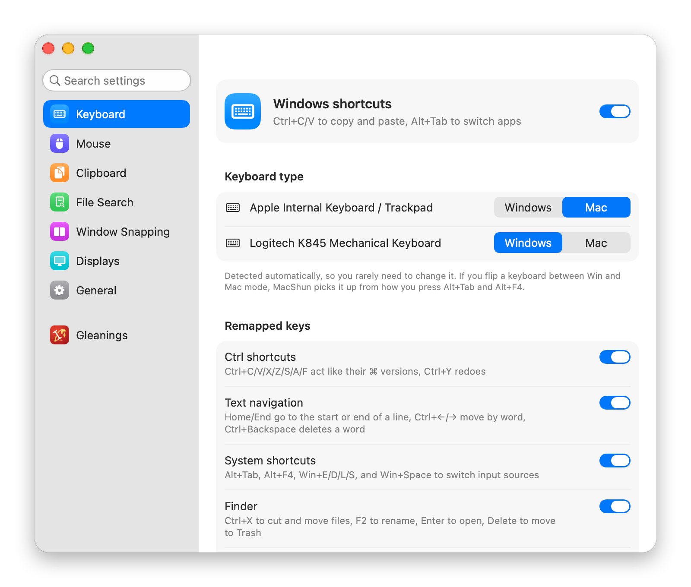
  </picture>
</p>

### Features

#### 📋 Clipboard history (Option+V / Win+V)

- Right-click an image and choose **Copy Text from Image** for the full recognized text. Enter pastes the image.
- **Find pictures by their text.** MacShun recognizes saved clipboard images locally, including older entries. Search for a word or its pinyin, then press Enter to paste the original image or F3 to float it on screen.

- Press **Option+V** on a Mac keyboard or **Win+V** on a Windows keyboard. You can also choose **Open Clipboard History** from the MacShun menu bar icon. Press Return to paste an item. In the file search bar, the selected text goes into the query.
- **Pinyin search** for Chinese text (full pinyin or initials, e.g. `jtb` finds 剪贴板).
- Stores text and images; pin the items you use often. “Clear All” in the top-right corner empties the history and keeps pinned items.
- Skips content that password managers mark as concealed. Everything stays on your Mac.

<p align="center">
  <picture>
    <source media="(prefers-color-scheme: dark)" srcset="docs/images/panel-dark-en.png">
    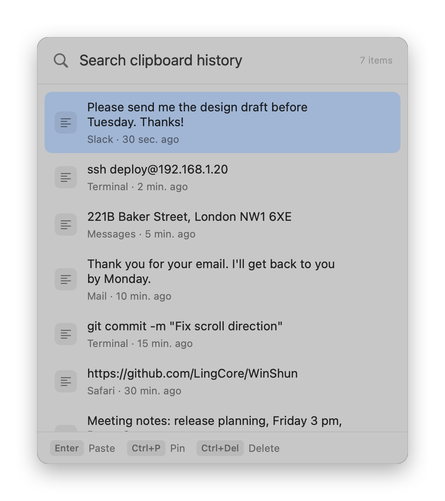
  </picture>
</p>

#### Screenshots and text capture

- Choose **Take a Screenshot** from the menu bar. Drag an area or click a window, then move or resize the selection. Add arrows, rectangles or solid redactions. Press **Enter** to copy, **⌘S** to save a PNG, or **Esc** to cancel.
- Choose **Copy Text from Screen** and release the mouse to copy text. Simplified Chinese, Traditional Chinese and English are recognized on the Mac.
- **Add notes and numbered steps.** Select Text and click to type. Enter commits the text, and double-clicking a label lets you edit it. Choose Step Number and click to place successive badges. Select a mark to move or delete it. ⌘Z undoes a change and ⇧⌘Z redoes it.
- **Repeat a region.** Press R to recall the last successfully exported region on its display. Arrow keys move the selection by one physical pixel, and Shift with an arrow adjusts its width or height. The size beside the selection is the exported pixel size.
- **Scrolling screenshots**: select the scrollable content of a page, document or chat and press **⌘L / Ctrl+L**. When the controls are ready, scroll slowly down inside the blue frame. Click **Finish** to review. Choose **Annotate** to mark any part of the long image, then **Done** to return to the preview and copy, save a PNG or float it. With Accessibility access, Enter finishes and Esc cancels. Select the scrolling body to avoid repeating a fixed sidebar, and pause large videos before capturing. If an overlap is lost, scroll back slightly and continue.
- **Float an image** with F3 or the Float on Screen button after making a selection. You can also float a clipboard image from the menu bar or an image entry in history. Drag to move, drag a corner or scroll to zoom, double-click for actual size, and Control-scroll for opacity. Right-click to copy, save or close.
- Both actions have optional shortcuts under **Settings › Keyboard › Screenshot shortcuts**. Allow screen recording when prompted on first use.

#### 🔍 File search (like Everything)

- **Press Ctrl twice** to open a capsule search bar; results appear as you type, instantly even across tens of thousands of files. Pressing it again while open keeps it open; Esc closes it.
- **Pinyin search** for Chinese file and app names.
- **Find system features in everyday language**: try “no sound” for Sound Output or “task manager” for Activity Monitor. Press Enter to open the selected result, or choose **System** to browse. Matching happens on your Mac.
- **Searches file contents too**: text inside txt, Markdown, CSV and JSON files, code (ts, js, py, swift, vue, html…), config (yaml, xml, toml), subtitles (srt, ass, lrc), plus Word, Excel, PowerPoint and PDF (skipping generated and dependency folders like node_modules, dist and build); text in screenshots, photos and scanned PDFs is recognized too, with the matching line shown in the results. Works for short Chinese queries and doesn't depend on Spotlight. Start in **Files & Features**. Press Tab to switch to **Contents**, **System**, or **All**; only Contents and All search inside files. Files you open often rank higher.
- **Filter files** with `quote *.pdf !draft` to find PDFs and exclude names containing “draft”. Use `ext:pdf,docx` for either type. In Contents, words match document text while filters apply to the file name. Quote the whole query to search for a literal name such as `"!important"`.
- Enter opens the selection and Ctrl+Enter reveals it in Finder. Press **⌘Y** or click Quick Look to preview it, use ↑↓ to browse matches, and press Esc to return to the selected result.
- **Search within a project.** Select a folder and press **⌘F**, or choose **Search in This Folder** from its context menu. Words and filters apply throughout its subfolders. Choose Contents for previously indexed text. **Esc** returns to the previous query and selection.
- **Jump to a folder in Open and Save dialogs.** With a native file dialog active, press **Ctrl twice** and find a folder or file. Press **Enter** to go to that folder or the file’s enclosing folder. The Save dialog keeps the name you entered.
- **Paste a path**: relative paths like `art/gpt/style_reference.png`, paths written with Finder's localized folder names, `~/Desktop/…` and full paths all work, and so do Windows paths like `D:\Docs\contract.docx` (quoted or not; the drive letter is ignored). If the folders are partly wrong, files with a matching name still show up, ranked by how much of the path matches. A native folder path ending in `/` lists its immediate children, even outside the index. Keep typing to filter that folder. Words can also match a mix of folder and file names: `spring quote` finds `Spring Project/Quote.xlsx`. Exact names come first, with ties favoring the current Finder folder.
- Searches your home folder, Applications and external drives (scanned in the background, Windows system folders skipped). The file name index stays in memory and the content index stays on your Mac; nothing goes online.

<p align="center">
  <picture>
    <source media="(prefers-color-scheme: dark)" srcset="docs/images/search-dark-en.png">
    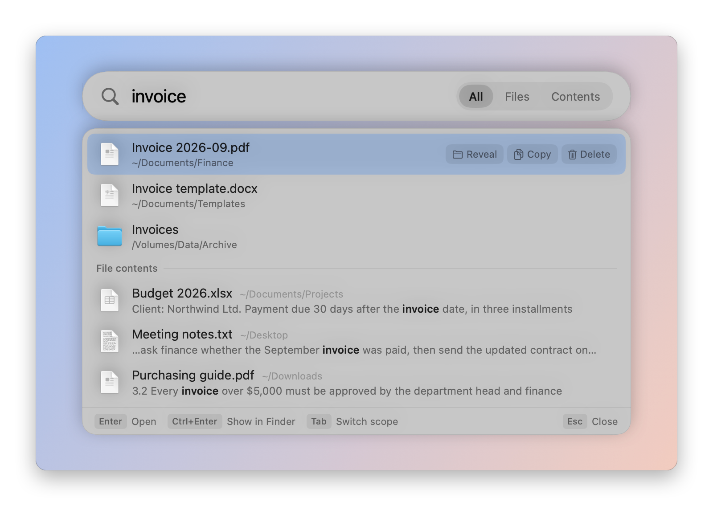
  </picture>
</p>

#### 🪟 Window snapping (like Windows 11)

- **Win+← / →** snaps to the left or right half; from a half, **Win+↑ / ↓** snaps to a quarter. The opposite arrow restores the window, the same arrow again moves it to the next display.
- **Win+↑** maximizes, **Win+↓** restores or minimizes; **Win+Shift+← / →** moves the window to the other display.
- **Drag to screen edges**: left or right edge for halves, top edge to maximize, corners for quarters. Dragging a snapped window restores its size. Drag freely between displays. To snap at a shared edge, pause near the edge on the display you want, then release when the preview appears.
- **Snap Assist**: after snapping to a half, your other windows appear in the other half; click one to fill it. Neither Rectangle nor macOS tiling has this.

<p align="center">
  <picture>
    <source media="(prefers-color-scheme: dark)" srcset="docs/images/snap-dark-en.png">
    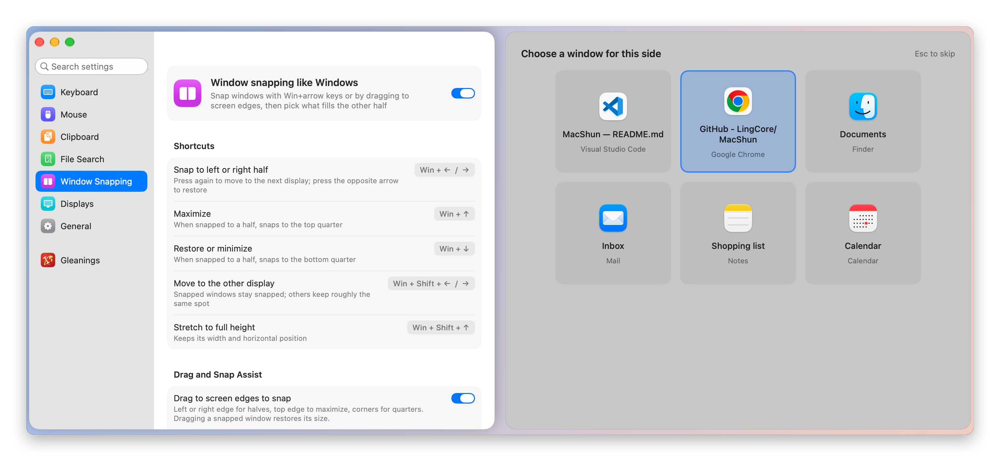
  </picture>
</p>

#### 🖱️ Windows mouse behavior on Mac

- **Disable mouse acceleration**: pointer movement is linear, just like Windows. Speed can go beyond the fastest system setting.
- **Windows scroll direction for the mouse only**: the trackpad and Magic Mouse keep Apple's natural scrolling.
- **Line-by-line scrolling**: a fixed number of lines per notch (3 by default), no scroll acceleration.
- **Back / forward side buttons** work in Finder, browsers and every other app. Each side button can also be set to copy, paste, close tab, task view, clipboard history, or any shortcut you record (in Windows terms, e.g. Ctrl+Shift+T). If you set up the side buttons in Logitech, Razer or other mouse software, choose “Leave alone” and the buttons go straight to it.
- **Cursor size** right in the mouse settings, 1× to 4×, like Windows. Restored when you quit MacShun.
- Per-device settings when you use more than one mouse.

<p align="center">
  <picture>
    <source media="(prefers-color-scheme: dark)" srcset="docs/images/mouse-dark-en.png">
    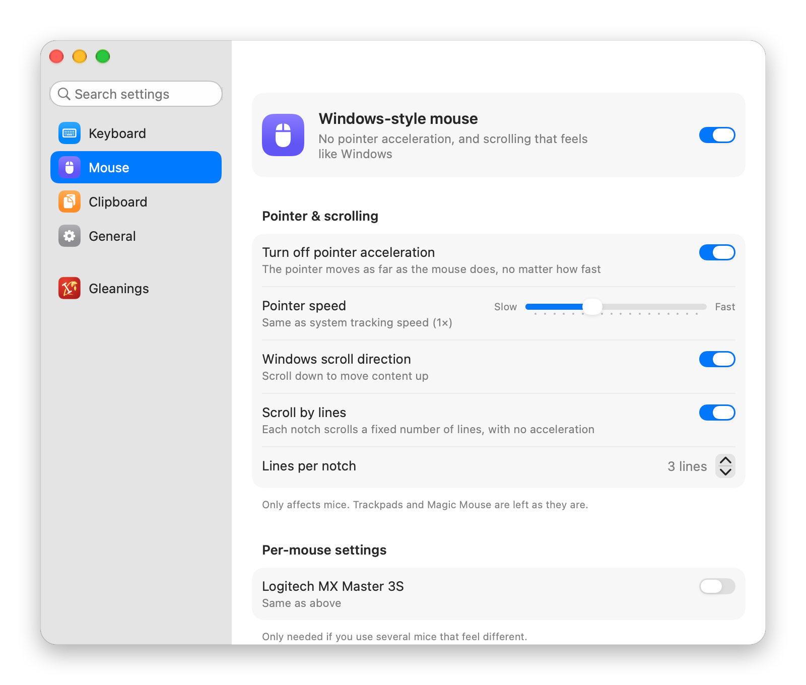
  </picture>
</p>

#### 🖥️ Display scaling and refresh rate

- Pick scaling for each screen in Windows-style percentages (100%, 125%, 150%…) instead of guessing "looks like" resolutions.
- Only sharp options are listed. For non-Retina screens such as 1440p monitors, macOS only offers 100% and 200% sharply, and the page says so.
- Pick the refresh rate for each screen (144 Hz, 120 Hz, 60 Hz…) right next to scaling.

<p align="center">
  <picture>
    <source media="(prefers-color-scheme: dark)" srcset="docs/images/display-dark-en.png">
    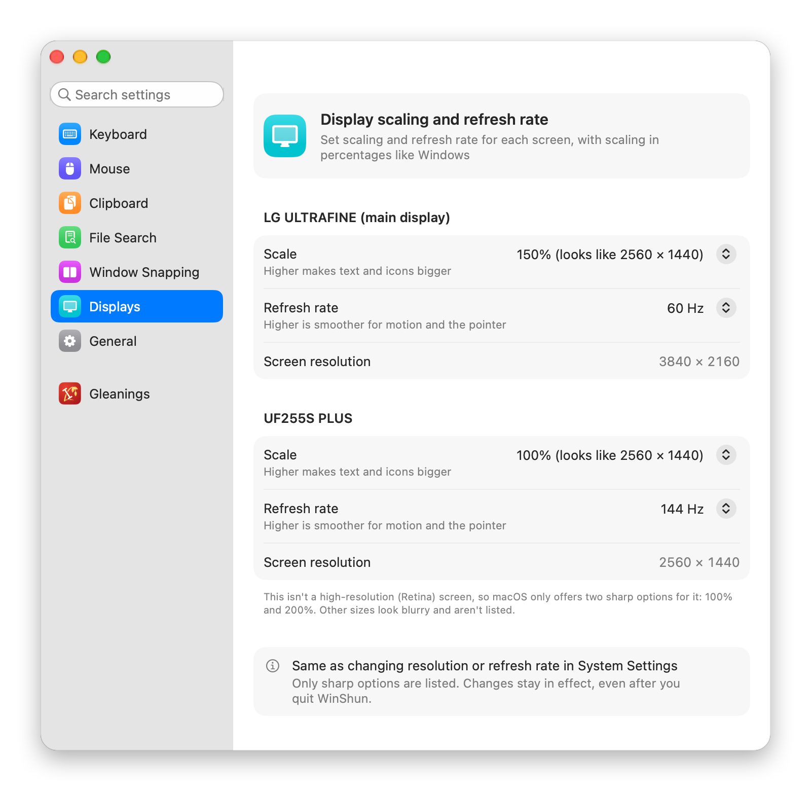
  </picture>
</p>

#### ⌨️ Windows keyboard shortcuts on Mac

- **Ctrl shortcuts**: Ctrl+C / V / X / Z / S / A / F and friends work like ⌘; Ctrl+Y is redo.
- **Text navigation**: Home / End jump to the start / end of the line, Ctrl+Home / End to the start / end of the document, Ctrl+← / → move by word, Ctrl+Backspace deletes a word; hold Shift to select.
- **System shortcuts**: Alt+Tab switches apps, Alt+F4 closes the window, Win+E opens Finder, Win+D shows the desktop, Win+L locks the screen, Win+S searches, Win+Space switches input method.
- **Finder**: Ctrl+X then Ctrl+V cuts and moves files, F2 renames, Enter opens, Delete moves to Trash, Backspace goes up a folder.
- **Leaves things alone where it should**: Terminal keeps its Ctrl keys; remote desktop and virtual machine apps are never remapped.
- **Works with both keyboard types**: Windows and Mac keyboards put Ctrl, Option and ⌘ in different places — MacShun detects which one you are typing on.

Every option can be found with the **search box** at the top of the settings window (⌘F).

### Download and install

1. Download `MacShun-<version>.dmg` from the [Releases page](https://github.com/LingCore/MacShun/releases/latest). **One universal file runs natively on both Apple Silicon (M1/M2/M3/M4…) and Intel Macs.**
2. Open the dmg and drag **Mac顺** into Applications.
3. On first launch macOS says it cannot verify the developer, because the app is not yet signed with a paid Apple Developer ID. Open it once using either method; macOS won't ask again:
   - Go to **System Settings → Privacy & Security**, scroll down and click **Open Anyway**.
   - Or run in Terminal: `xattr -dr com.apple.quarantine "/Applications/Mac顺.app"`
4. Grant the permissions below. When the MacShun icon appears in the menu bar, it is running.

Requires macOS 14 Sonoma or later.

### Permissions

| Permission | Why |
|---|---|
| Accessibility | Remap keys, paste from history, find the text cursor, move and resize other apps' windows (snapping) |
| Input Monitoring | Tell which keyboard or mouse an event came from (per-device settings) |
| Pasteboard access | Record clipboard history in the background (choose "Always Allow") |
| Files and Folders | The first time you open file search, macOS asks about Desktop, Documents and Downloads; folders you deny won't be searched |

The settings window walks you through each one, and changes take effect immediately.

### FAQ

**How do I use Ctrl+C and Ctrl+V on a Mac?**
Install MacShun. It turns Ctrl+letter into ⌘+letter in every app, except Terminal, where Ctrl keeps its usual meaning.

**How do I reverse the mouse scroll direction without changing the trackpad?**
macOS ties the two together. MacShun changes the direction for mice only.

**How do I turn off mouse acceleration on macOS?**
Enable "linear pointer" on MacShun's Mouse page.

**Is there a Win+V clipboard history for Mac?**
Yes. On a Mac keyboard, **Option+V** opens history and **Command+V** pastes. On a Windows keyboard, press **Win+V** for history. With Windows shortcuts turned off, choose **Open Clipboard History** from the MacShun menu bar icon.

**How do I snap windows with Win+arrow keys on a Mac, like on Windows?**
Install MacShun: Win+← / → snaps to halves, Win+↑ maximizes, dragging to screen edges snaps too, and Snap Assist offers your other windows for the other half.

**How is it different from Karabiner-Elements, LinearMouse, Maccy or Rectangle?**
Those are great tools, but each does one thing and needs setup. MacShun does keyboard, mouse, clipboard and window snapping together, with Windows behavior as the default, and is tuned for Chinese users (pinyin search, WeChat / QQ screenshot keys, popular Chinese remote desktop apps).

**Is there an Everything-like file search for Mac?**
MacShun includes one: press Ctrl twice and start typing.

**How do I search text inside Word, Excel or PDF files on a Mac?**
MacShun's file search also matches contents of txt, CSV, JSON, code, Word, Excel, PowerPoint and PDF files, including on external NTFS drives, and shows the matching line.

**How do I use different scaling on two monitors?**
macOS supports per-display scaling; MacShun's Displays page shows it as Windows-style percentages, one menu per screen.

**I have WinShun installed. How do I upgrade?**
WinShun has been renamed MacShun. Quit WinShun from the menu bar, drag Win顺 from Applications to the Trash, then install MacShun. Permissions, settings and clipboard history carry over, so there is nothing to grant again.

**Is it free? Does it collect data?**
Free and open source. MacShun only goes online for two things: checking for and downloading updates (automatic checks can be turned off in Settings) — update checks contact the Gleaning release service, while installers are downloaded through third-party accelerated mirrors (currently gh-proxy.com, then ghfast.top) with GitHub as the last fallback, and no personal information is sent in those requests — and an anonymous install report at most once a day to the Gleaning release service, used to count users. The report contains only a randomized computer ID (a SHA-256 of the machine identifier plus the project name, which cannot be reversed), the app version, the macOS version and the chip architecture; no files, clipboard content or personal information. Turn off "Send anonymous usage statistics" in Settings › General and nothing is sent. your clipboard history stays on your Mac.

**How do I update?**
MacShun periodically checks the Gleaning release service. When there is a new version, a window shows what's new; click Update Now to download it from an accelerated mirror (falling back to the next address, and finally to the original GitHub URL), verify its size, SHA-256 and signature, then install and reopen, keeping settings and permissions. Mirrors are third parties, so trust comes entirely from those checks: a file with a wrong digest is discarded. You only see an error to retry if every address fails. You can also choose Check for Updates… from the menu bar icon. Version 0.3.0 checks GitHub for updates and switches to the Gleaning release service once it upgrades to 0.4.0.

### Feedback

Bug reports and suggestions are welcome in [Issues](https://github.com/LingCore/MacShun/issues).

### Build from source

Only the Command Line Tools are needed (`xcode-select --install`), not Xcode.

```bash
scripts/dev-cert.sh            # once: create a local code-signing certificate
scripts/build-app.sh --install # build, install to /Applications and launch
scripts/test.sh                # run unit tests
scripts/check-l10n.py          # check that every UI string has an English translation
scripts/release.sh             # build the universal release dmg (Apple Silicon + Intel)
```

---

## LINUX DO

本项目积极参与并认可 [LINUX DO 社区](https://linux.do)。

MacShun is proud to be part of the [LINUX DO community](https://linux.do).

## 许可证 · License

Mac顺 以 [MIT 许可证](LICENSE) 发布。Copyright © 2026 LingCore.
借用的第三方代码登记在 [THIRD_PARTY_NOTICES.md](THIRD_PARTY_NOTICES.md)。

MacShun is released under the [MIT License](LICENSE). Copyright © 2026 LingCore.

Windows 是微软公司的商标，Mac 和 macOS 是苹果公司的商标。本项目与微软、苹果没有任何关联。
Windows is a trademark of Microsoft Corporation. Mac and macOS are trademarks of Apple Inc. This project is not affiliated with Microsoft or Apple.
